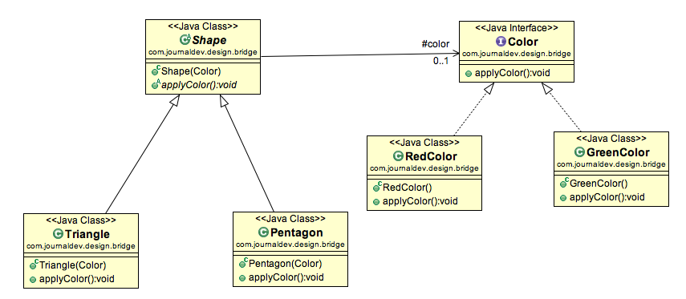

When we have interface hierarchies in both interfaces as well as implementations, then bridge design pattern is used to decouple the interfaces from implementation and hiding the implementation details from the client programs so that the abstraction and its implementation can vary independently.



The implementation of bridge design pattern follows the principle of preferring  composition over inheritance.

```java
interface Color {
  public void applyColor();
}

abstract class Shape {
  //Composition - implementor
  protected Color color;

  //constructor with implementor as input argument
  public Shape(Color c){
    this.color=c;
  }

  abstract public void applyColor();
}

class Triangle extends Shape{
  public Triangle(Color c) {
    super(c);
  }

  @Override
  public void applyColor() {
    System.out.print("Triangle filled with color ");
    color.applyColor();
  }
}

class Pentagon extends Shape{
  public Pentagon(Color c) {
    super(c);
  }

  @Override
  public void applyColor() {
    System.out.print("Pentagon filled with color ");
    color.applyColor();
  }
}

class RedColor implements Color{
  public void applyColor(){
    System.out.println("red.");
  }
}

class GreenColor implements Color{
  public void applyColor(){
    System.out.println("green.");
  }
}

public class BridgePatternTest {
  public static void main(String[] args) {
    Shape tri = new Triangle(new RedColor());
    tri.applyColor();

    Shape pent = new Pentagon(new GreenColor());
    pent.applyColor();
  }
}
```

live code https://repl.it/join/wjvaiwel-lubaochuan

```java
interface FileDownloaderAbstraction {
  public Object download(String path);
  public boolean store(Object object);
}

class FileDownloaderAbstractionImpl implements FileDownloaderAbstraction {
  private FileDownloadImplementor provider = null;

  public FileDownloaderAbstractionImpl(FileDownloadImplementor provider) {
    super();
    this.provider = provider;
  }

  @Override
  public Object download(String path) {
    return provider.downloadFile(path);
  }

  @Override
  public boolean store(Object object) {
    return provider.storeFile(object);
  }
}

interface FileDownloadImplementor{
  public Object downloadFile(String path);
  public boolean storeFile(Object object);
}

class LinuxFileDownloadImplementor implements FileDownloadImplementor {
  @Override
  public Object downloadFile(String path) {
    return new Object();
  }

  @Override
  public boolean storeFile(Object object) {
      System.out.println("File downloaded successfully in LINUX !!");
    return true;
  }
}

class WindowsFileDownloadImplementor implements FileDownloadImplementor {
  @Override
  public Object downloadFile(String path) {
    return new Object();
  }

  @Override
  public boolean storeFile(Object object) {
    System.out.println("File downloaded successfully in WINDOWS !!");
    return true;
  }
}

public class Client {
  public static void main(String[] args) {
    String os = "linux";
    FileDownloaderAbstraction downloader = null;

    switch (os) {
      case "windows":
        downloader = new FileDownloaderAbstractionImpl( new WindowsFileDownloadImplementor() );
        break;
      case "linux":
        downloader = new FileDownloaderAbstractionImpl( new LinuxFileDownloadImplementor() );
        break;   
      default:
        System.out.println("OS not supported !!");
    }

    Object fileContent = downloader.download("some path");
    downloader.store(fileContent);
  }
}
```

## Change in abstraction does not affect implementation
Now if you want to add one more capability (i.e. delete) at abstraction layer. It will not force a change in existing implementers and client as well.

```java
interface FileDownloaderAbstraction {
  public Object download(String path);
  public boolean store(Object object);
  public boolean delete(String object);
}

class FileDownloaderAbstractionImpl implements FileDownloaderAbstraction {
  private FileDownloadImplementor provider = null;

  public FileDownloaderAbstractionImpl(FileDownloadImplementor provider) {
    super();
    this.provider = provider;
  }

  @Override
  public Object download(String path) {
    return provider.downloadFile(path);
  }

  @Override
  public boolean store(Object object) {
    return provider.storeFile(object);
  }

  @Override
  public boolean delete(String object) {
    return false;
  }
}
```

## Change in implementation does not affect abstraction
If you want to add delete feature at implementation layer for all downloaders (an internal feature) which client should not know about.

```java
interface FileDownloadImplementor {
  public Object downloadFile(String path);
  public boolean storeFile(Object object);
  public boolean delete(String object);
}

class LinuxFileDownloadImplementor implements FileDownloadImplementor {
  @Override
  public Object downloadFile(String path) {
    return new Object();
  }

  @Override
  public boolean storeFile(Object object) {
    System.out.println("File downloaded successfully in LINUX !!");
    return true;
  }

  @Override
  public boolean delete(String object) {
    return false;
  }
}

class WindowsFileDownloadImplementor implements FileDownloadImplementor {
  @Override
  public Object downloadFile(String path) {
    return new Object();
  }

  @Override
  public boolean storeFile(Object object) {
    System.out.println("File downloaded successfully in LINUX !!");
    return true;
  }

  @Override
  public boolean delete(String object) {
    return false;
  }
}
```

sources:
* https://www.journaldev.com/1491/bridge-design-pattern-java
* https://howtodoinjava.com/design-patterns/structural/bridge-design-pattern/
