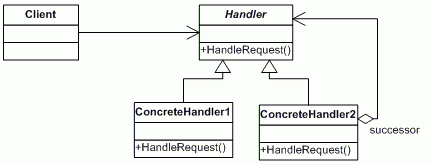

The Chain of Responsibility, a behavioral pattern aims to avoid coupling the sender of the request to the receiver, giving more than one object the opportunity to handle the request. The core logic defined by GoF is :

  "Gives more than one object an opportunity to handle a request by linking receiving objects together."



```java
enum ServiceLevel{
  LEVEL_ONE, LEVEL_TWO, LEVEL_THREE, LEVEL_FOUR, INVALID_REQUEST
}

class ServiceRequest {
  private ServiceLevel type;
  private String conclusion = null;

  public ServiceLevel getType() {
    return type;
  }
  public void setType(ServiceLevel type) {
    this.type = type;
  }
  public String getConclusion() {
    return conclusion;
  }
  public void setConclusion(String conclusion) {
    this.conclusion = conclusion;
  }
}

interface SupportServiceInterface{
  public void handleRequest(ServiceRequest request);
}

class FrontDeskSupport implements SupportServiceInterface {
  private SupportServiceInterface next = null;

  public SupportServiceInterface getNext() {
    return next;
  }

  public void setNext(SupportServiceInterface next) {
    this.next = next;
  }

  @Override
  public void handleRequest(ServiceRequest service) {
    if(service.getType() == ServiceLevel.LEVEL_ONE){
      service.setConclusion("Front desk solved level one request !!");
    }else{
      if(next != null){
        next.handleRequest(service);
      }else{
        throw new IllegalArgumentException("No handler found for ::"  + service.getType());
      }
    }
  }
}

class SupervisorSupport implements SupportServiceInterface {
  private SupportServiceInterface next = null;

  public SupportServiceInterface getNext() {
    return next;
  }

  public void setNext(SupportServiceInterface next) {
    this.next = next;
  }

  @Override
  public void handleRequest(ServiceRequest request) {
    if(request.getType() == ServiceLevel.LEVEL_TWO){
      request.setConclusion("Supervisor solved level two request !!");
    }else{
      if(next != null){
        next.handleRequest(request);
      }else{
        throw new IllegalArgumentException("No handler found for :: " + request.getType());
      }
    }
  }
}

class ManagerSupport implements SupportServiceInterface {
  private SupportServiceInterface next = null;

  public SupportServiceInterface getNext() {
    return next;
  }

  public void setNext(SupportServiceInterface next) {
    this.next = next;
  }

  @Override
  public void handleRequest(ServiceRequest request) {
    if(request.getType() == ServiceLevel.LEVEL_THREE){
      request.setConclusion("Manager solved level three request !!");
    }else{
      if(next != null){
        next.handleRequest(request);
      }else{
        throw new IllegalArgumentException("No handler found for :: " + request.getType());
      }
    }
  }
}

class DirectorSupport implements SupportServiceInterface {
  private SupportServiceInterface next = null;

  public SupportServiceInterface getNext() {
    return next;
  }

  public void setNext(SupportServiceInterface next) {
    this.next = next;
  }

  @Override
  public void handleRequest(ServiceRequest request) {
    if(request.getType() == ServiceLevel.LEVEL_FOUR){
      request.setConclusion("Director solved level four request !!");
    }else{
      if(next != null){
        next.handleRequest(request);
      }else{
        request.setConclusion("Your problem is none of our business");
        throw new IllegalArgumentException("Your problem is none of our business :: " + request.getType());
      }
    }
  }
}

public class TestChainOfResponsibility {
  public static void main(String[] args){
    SupportServiceInterface supportService =
      new FrontDeskSupport().setNext(
        new SupervisorSupport().setNext(
          new ManagerSupport().setNext(
            new ManagerSupport().setNext(null);
          )
        )
      )

    ServiceRequest request = new ServiceRequest();
    request.setType(ServiceLevel.LEVEL_ONE);
    supportService.handleRequest(request);
    System.out.println(request.getConclusion());

    request = new ServiceRequest();
    request.setType(ServiceLevel.LEVEL_THREE);
    supportService.handleRequest(request);
    System.out.println(request.getConclusion());

    request = new ServiceRequest();
    request.setType(ServiceLevel.INVALID_REQUEST);
    supportService.handleRequest(request);
    System.out.println(request.getConclusion());
  }
}
```

live code https://repl.it/join/fwgiujjf-lubaochuan

sources:
* https://howtodoinjava.com/design-patterns/behavioral/chain-of-responsibility-design-pattern/
