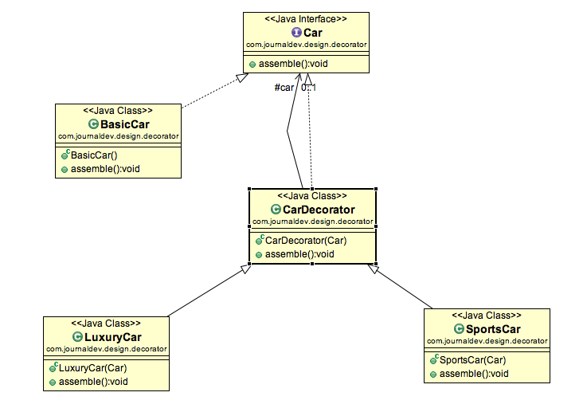

Decorator design pattern is used to modify the functionality
of an object at runtime. At the same time other instances of
the same class will not be affected by this, so individual object
gets the modified behavior.



```java
interface Car {
	public void assemble();
}

class BasicCar implements Car {
	@Override
	public void assemble() {
		System.out.print("Basic Car.");
	}
}

class CarDecorator implements Car {
	protected Car car;

	public CarDecorator(Car c){
		this.car=c;
	}

	@Override
	public void assemble() {
		this.car.assemble();
	}
}

class SportsCar extends CarDecorator {
	public SportsCar(Car c) {
		super(c);
	}

	@Override
	public void assemble(){
		super.assemble();
		System.out.print(" Adding features of Sports Car.");
	}
}

class LuxuryCar extends CarDecorator {
	public LuxuryCar(Car c) {
		super(c);
	}

	@Override
	public void assemble(){
		super.assemble();
		System.out.print(" Adding features of Luxury Car.");
	}
}

public class DecoratorPatternTest {
	public static void main(String[] args) {
		Car sportsCar = new SportsCar(new BasicCar());
		sportsCar.assemble();
		System.out.println("\n*****");

		Car sportsLuxuryCar = new SportsCar(new LuxuryCar(new BasicCar()));
		sportsLuxuryCar.assemble();
	}
}
```

live code https://repl.it/join/jawfzsed-lubaochuan

sources:
*
